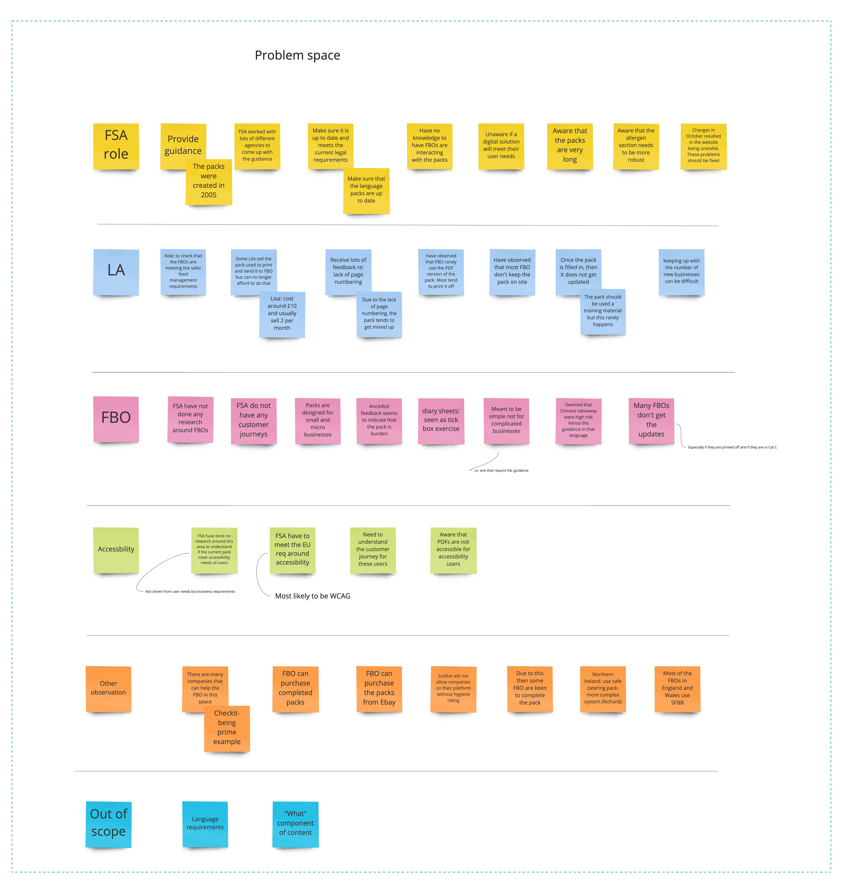
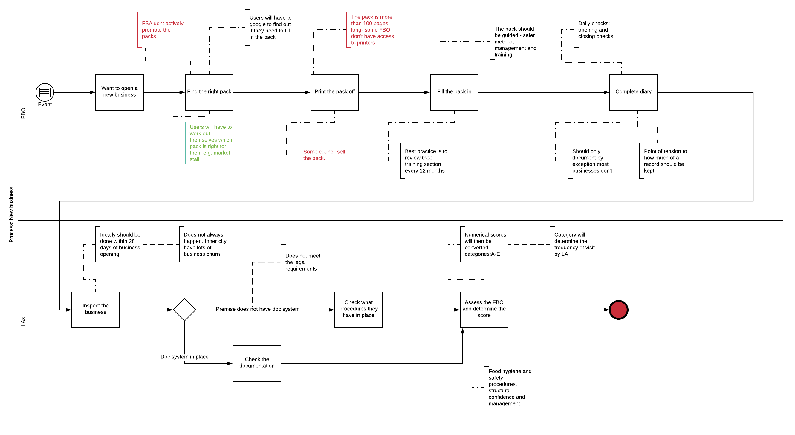
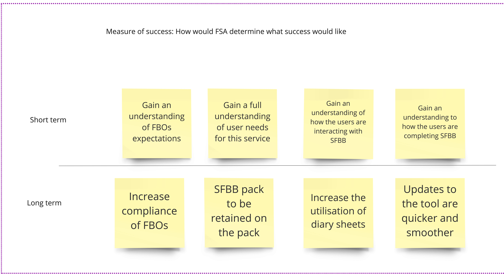

Early on in the discovery we conducted a business landscape workshop with the aim of understanding the business context, including business requirements.

The full list of areas explored in the workshop can be seen [here](uploads/Business_landscape_workshop_.pdf)
 

Key areas covered were:

* Understanding the problem space 
* Identifying the FSA users, including their expectations 
* Communication 
* Mapping out the existing process 
* Establishing success measures 

Key outputs were as follows:

### 1. Understanding the problem space

### 2. The existing process

### 3. Success measures

The full output from the session can be viewed [here](uploads/Business_Landscape_workshop_1.jpg)

