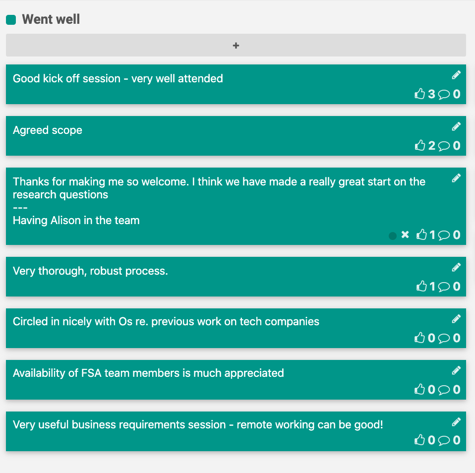
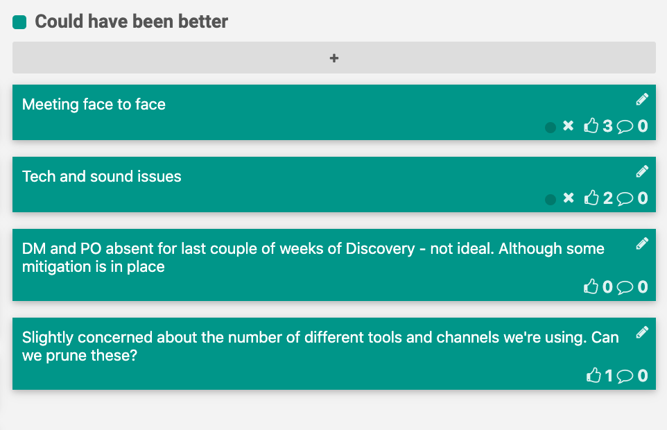
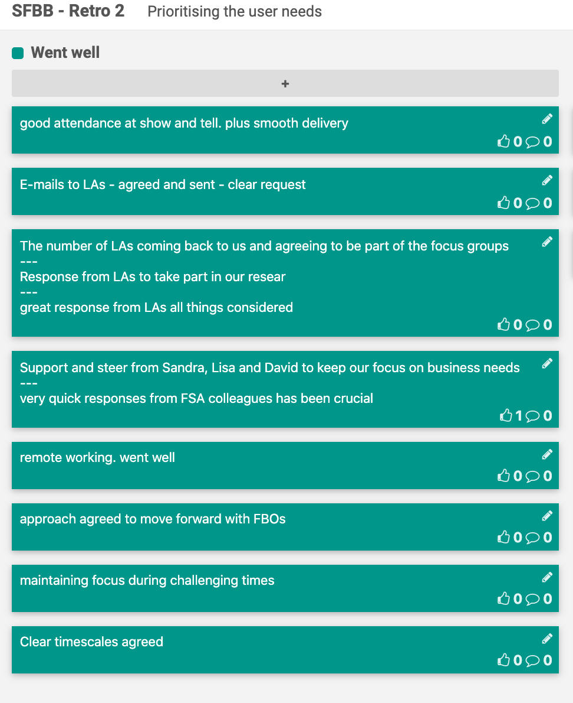
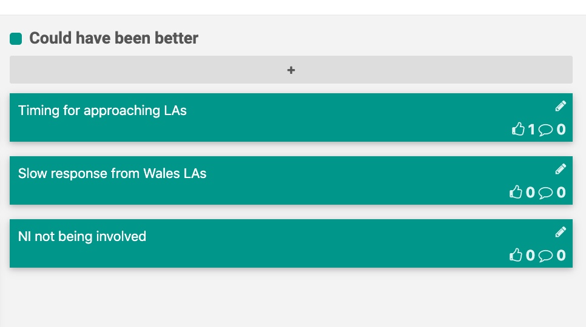

# Retrospectives

A retrospective is a ceremony held by an agile team at the end of each sprint to openly discuss what is going well and what needs improvement. It's a key activity to help the team iteratively improve their working culture.

[FunRetro](https://funretro.io/) is a great tool for disbursed teams.

## Sprint 1 (02/03/20 - 10/03/20)

### Happy

### Sad

## Sprint 2 (11/03/20 - 17/03/20)

### Happy

### Sad

